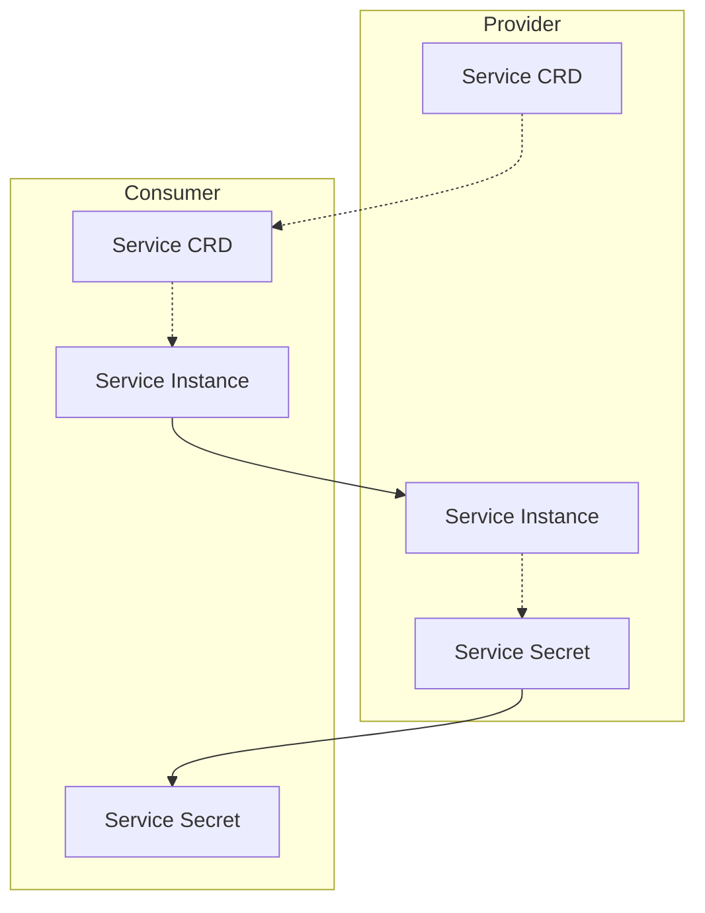
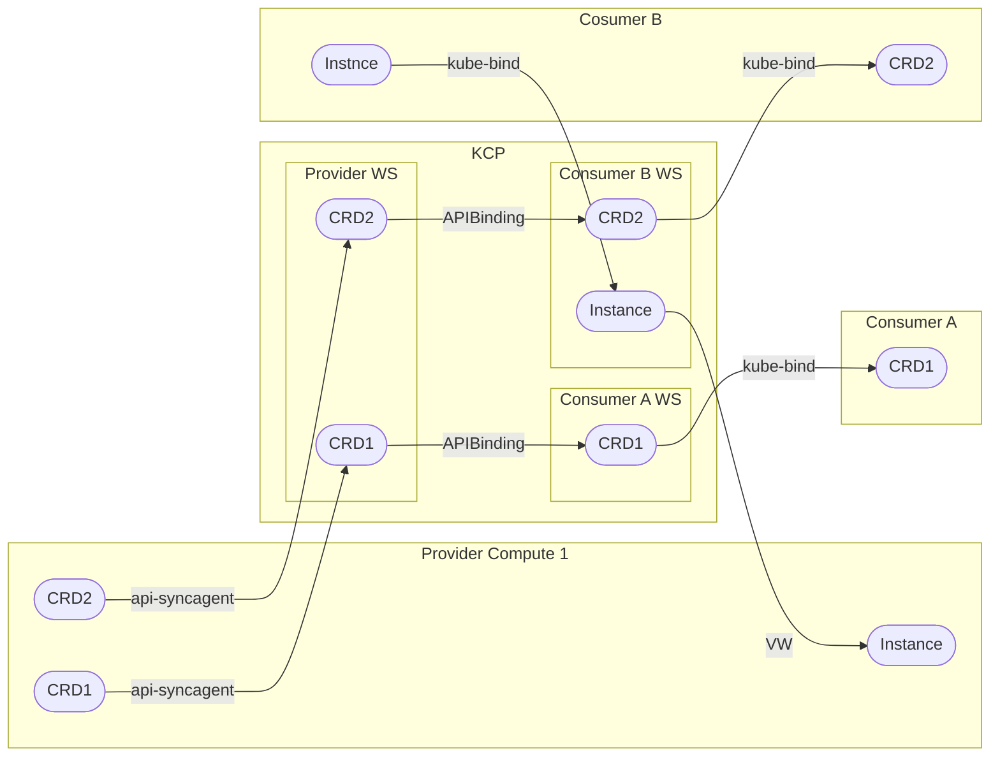
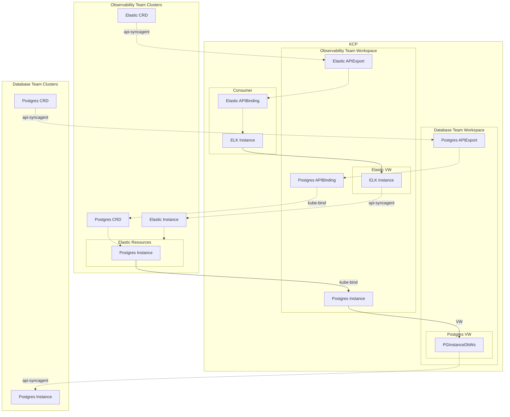

# Provider to Consumer (P2C)

## Kube to Kube

### Problem Description

In a provider to consumer setting a Provider wants to transfer technical
information in a secure way to a Consumer for a Service.

The Provider wants to expose as little information as needed while
giving the Consumer the ability to automatically consume instances of
the Service and retrieve the required information to interact with the
Service.

### Solution

The Provider can offer a kube-bind backend, allowing the Consumer to
authenticate with OIDC and to bind the CRD of the Service into their
Cluster - or any KRM API.

## KCP to Kube

### Problem Description

TODO

### Solution

api-syncagent is run by the provider to export offerings in the KCP workspace.
Consumers bind the APIExport and use kube-bind the pull the resulting CRD and push instances.

kube-bind can be a kube-bind backend in KCP or konnector run by the consumers.

## Internal Development Platform

### Problem Description

TODO

### Solution

KCP used as an internal developer platform with teams offering services that in turn utilize other services on the IDP.

Here the Observability team is offering Elastic instances. For Elastic they need a relational database and chose Postgres, which the Database team offers.

