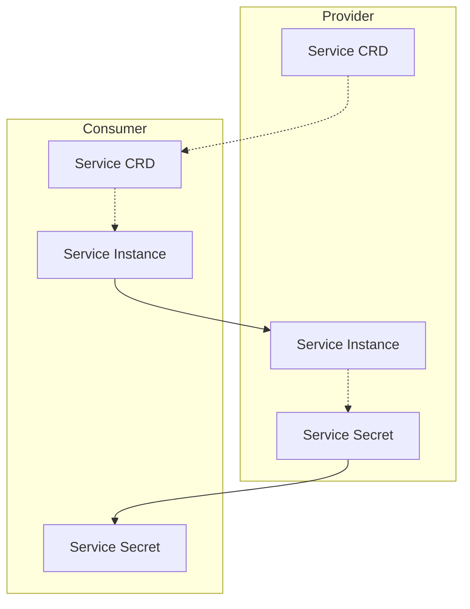
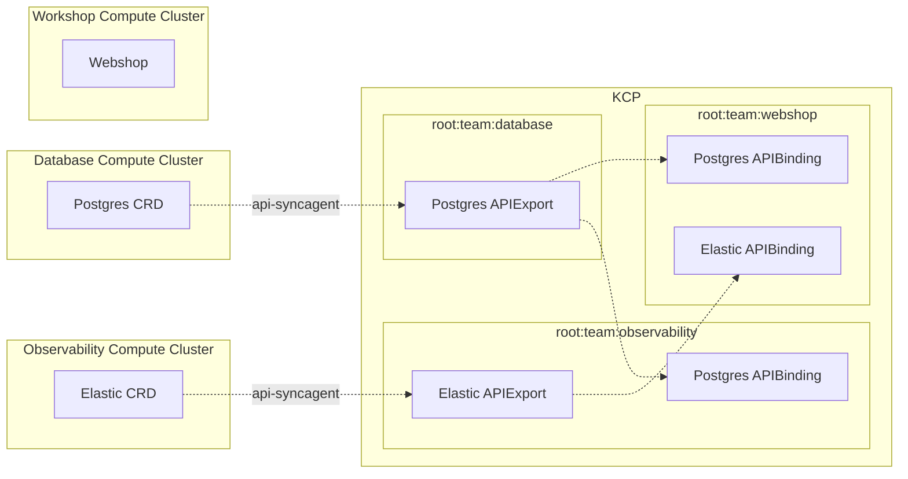
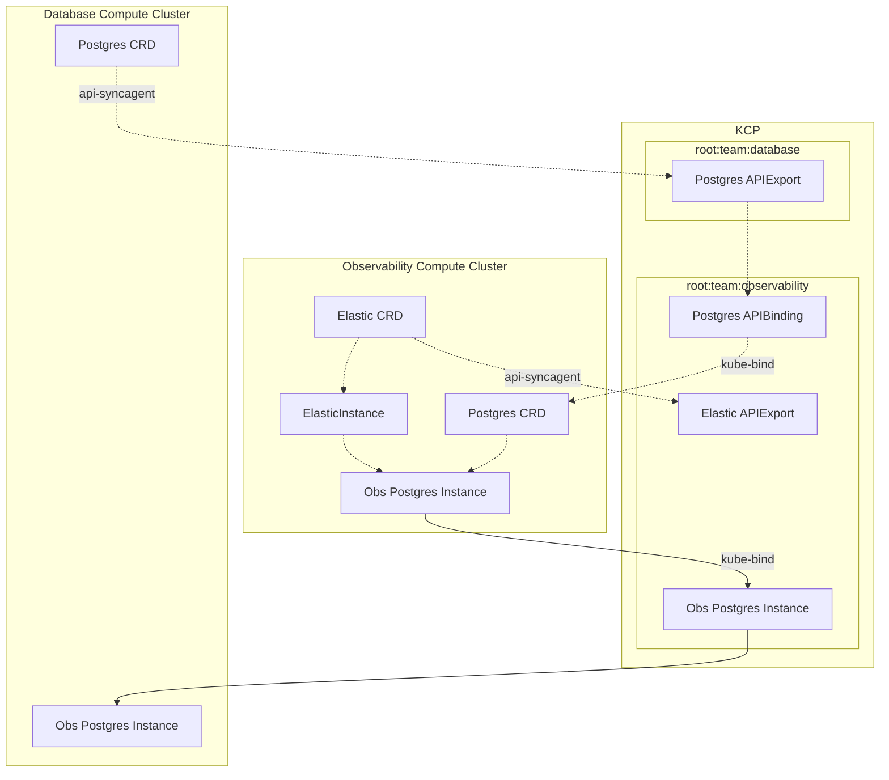
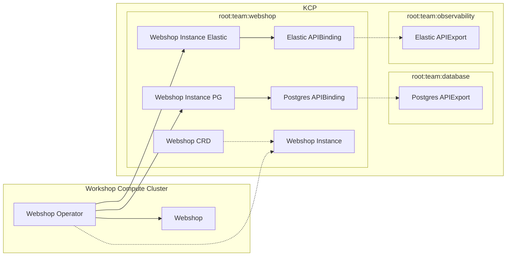

# Provider to Consumer (P2C)

## Kube to Kube

### Problem Description

In a provider to consumer setting a Provider wants to transfer technical
information in a secure way to a Consumer for a Service.

The Provider wants to expose as little information as needed while
giving the Consumer the ability to automatically consume instances of
the Service and retrieve the required information to interact with the
Service.

### Solution

The Provider can offer a kube-bind backend, allowing the Consumer to
authenticate with OIDC and to bind the CRD of the Service into their
Cluster - or any KRM API.

## Kube to KCP to Kube

### Problem Description

The problem is specified on the example of an Internal Developer
Platform (IDP). Teams can be Providers and Consumer of Services.

The Database Team (DB) offers a Postgres Service.
The Observability Team (Obs) wants to use the Postgres Service as the
database for their Elastic service.
The Webshop Team (WS) wants to use the Postgres Services as the database
for the Webshops they maintain for their customers and the Elastic
Service for logging and metrics.

This diagram shows the premise of the problem:

Not pictures is the teams using e.g. GitOps to manage the components of
their services, which are running in the respective clusters.

### Tools Solution

This solution focuses on using commonly available tools to manage and
apply the manifests.

The Obersvability Team uses KRO (Kubernetes Resource Orchestrator) to
instantiate their Elastic Service, including the Postgres Instance from
the Database Team.

Since KRO works only on one Cluster they are using kube-bind to pull the
CRD of the Postgres Services from the APIBinding they created in their
workspace to their compute cluster.

The postgres instance for an elastic service is created as part of the
KRO Resource Graph Definition, which is mirrored back to KCP by
kube-bind.

### Operator Solution

The Webshop team uses their own operator to manage their Webshop, which
they wrote using multicluster-runtime, allowing them to interact with
many clusters at once.

The Webshop team maintains definitions of the Webshop instances in their
KCP Workspace and are deploying resources based on these definitions
where they are needed.

The operator also provides the information from the database and elastic
service to the webshop instance.
