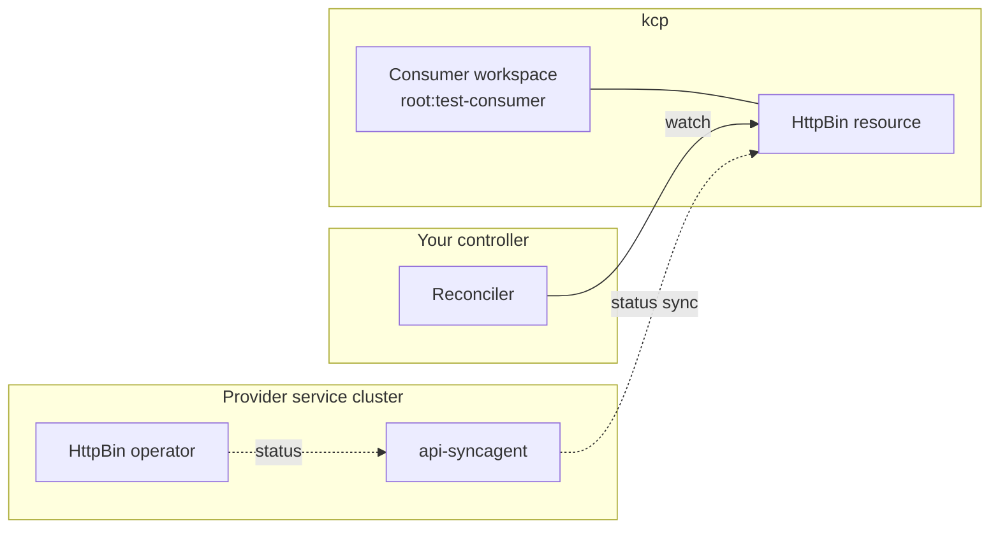

# Consume a service from a controller

This tutorial walks you through consuming the HttpBin API from your own Go controller. You will run a small controller against your kcp consumer workspace that watches `HttpBin` resources and reacts to provider status updates — the programmatic counterpart to creating one through the portal.

By the end of this tutorial, you will have:

- a Go controller built on `controller-runtime`
- a kubeconfig context pointing at your kcp consumer workspace
- the controller running locally, watching `HttpBin` resources in that workspace
- log output that reflects status updates flowing back from the provider service cluster

::: warning Development preview
The local setup is under active development. Commands and component versions may change.
:::

## Prerequisites

Before you begin, make sure you have completed:

- [Provider quick start](./provider-quick-start.md) — the HttpBin APIExport, api-syncagent, and the `test-consumer` workspace with an APIBinding to `orchestrate.platform-mesh.io` must already be in place.
- `kubectl` with the `kubectl-kcp` plugin installed.
- Go 1.22+ and Git installed.

For background on the binding mechanism this tutorial depends on, see [API sharing](/concepts/api-sharing.md).

## What you will build

Your controller subscribes to one consumer workspace and reacts to `HttpBin` resources as the provider syncs their status back. The data path you built in the provider quick start now flows the other way: provider status reaches kcp, the controller observes it, and you act on it.



The controller uses standard `controller-runtime` against the consumer workspace endpoint. Cross-workspace orchestration is the [advanced provider tutorial's](./build-multi-cluster-runtime-provider.md) job; this tutorial keeps the topology to a single workspace.

## Point a kubeconfig at the consumer workspace

Use the kcp admin kubeconfig from the local setup and switch to the consumer workspace:

```bash
export KCP_KUBECONFIG=$(pwd)/.secret/kcp/admin.kubeconfig
KUBECONFIG=$KCP_KUBECONFIG kubectl kcp workspace use :root:test-consumer
```

Verify the bound API is visible:

```bash
KUBECONFIG=$KCP_KUBECONFIG kubectl api-resources | grep httpbin
```

If the binding is missing, complete the [Provider quick start](./provider-quick-start.md) first.

## Bootstrap the controller module

Create a fresh Go module for the consumer:

```bash
mkdir httpbin-consumer && cd httpbin-consumer
go mod init example.com/httpbin-consumer
```

Add controller-runtime:

```bash
go get sigs.k8s.io/controller-runtime@latest
go get k8s.io/apimachinery@latest
```

## Define the HttpBin types the consumer needs

The provider operator's source is in [`platform-mesh/example-httpbin-operator`](https://github.com/platform-mesh/example-httpbin-operator), but the consumer does not need the full producer module. Define the minimal types the consumer reads in `types.go`:

```go
package main

import (
    metav1 "k8s.io/apimachinery/pkg/apis/meta/v1"
    "k8s.io/apimachinery/pkg/runtime"
    "k8s.io/apimachinery/pkg/runtime/schema"
)

var (
    groupVersion  = schema.GroupVersion{Group: "orchestrate.platform-mesh.io", Version: "v1alpha1"}
    schemeBuilder = runtime.NewSchemeBuilder(addKnownTypes)
    AddToScheme   = schemeBuilder.AddToScheme
)

type HttpBinSpec struct {
    Region string `json:"region,omitempty"`
}

type HttpBinStatus struct {
    Ready bool   `json:"ready,omitempty"`
    URL   string `json:"url,omitempty"`
}

type HttpBin struct {
    metav1.TypeMeta   `json:",inline"`
    metav1.ObjectMeta `json:"metadata,omitempty"`
    Spec              HttpBinSpec   `json:"spec,omitempty"`
    Status            HttpBinStatus `json:"status,omitempty"`
}

type HttpBinList struct {
    metav1.TypeMeta `json:",inline"`
    metav1.ListMeta `json:"metadata,omitempty"`
    Items           []HttpBin `json:"items"`
}

func (in *HttpBin) DeepCopyObject() runtime.Object {
    out := &HttpBin{}
    out.TypeMeta = in.TypeMeta
    in.ObjectMeta.DeepCopyInto(&out.ObjectMeta)
    out.Spec = in.Spec
    out.Status = in.Status
    return out
}

func (in *HttpBinList) DeepCopyObject() runtime.Object {
    out := &HttpBinList{}
    out.TypeMeta = in.TypeMeta
    in.ListMeta.DeepCopyInto(&out.ListMeta)
    if in.Items != nil {
        out.Items = make([]HttpBin, len(in.Items))
        for i := range in.Items {
            out.Items[i] = *in.Items[i].DeepCopyObject().(*HttpBin)
        }
    }
    return out
}

func addKnownTypes(s *runtime.Scheme) error {
    s.AddKnownTypes(groupVersion, &HttpBin{}, &HttpBinList{})
    metav1.AddToGroupVersion(s, groupVersion)
    return nil
}
```

The consumer side only reads `region`, `ready`, and `url`; the producer's full conditions list and other fields are not needed here. This keeps the consumer module independent of provider-side dependencies.

## Implement the reconciler

Create `main.go`:

```go
package main

import (
    "context"
    "log"

    ctrl "sigs.k8s.io/controller-runtime"
    "sigs.k8s.io/controller-runtime/pkg/client"
    "sigs.k8s.io/controller-runtime/pkg/manager/signals"
)

type HttpBinObserver struct {
    client.Client
}

func (r *HttpBinObserver) Reconcile(ctx context.Context, req ctrl.Request) (ctrl.Result, error) {
    var hb HttpBin
    if err := r.Get(ctx, req.NamespacedName, &hb); err != nil {
        return ctrl.Result{}, client.IgnoreNotFound(err)
    }

    if hb.Status.Ready {
        log.Printf("HttpBin %s/%s is Ready at %s", hb.Namespace, hb.Name, hb.Status.URL)
    } else {
        log.Printf("HttpBin %s/%s is not yet Ready (region=%s)", hb.Namespace, hb.Name, hb.Spec.Region)
    }

    return ctrl.Result{}, nil
}

func main() {
    cfg := ctrl.GetConfigOrDie()

    mgr, err := ctrl.NewManager(cfg, ctrl.Options{})
    if err != nil {
        log.Fatal(err)
    }

    if err := AddToScheme(mgr.GetScheme()); err != nil {
        log.Fatal(err)
    }

    if err := ctrl.NewControllerManagedBy(mgr).
        For(&HttpBin{}).
        Complete(&HttpBinObserver{Client: mgr.GetClient()}); err != nil {
        log.Fatal(err)
    }

    log.Println("starting manager")
    if err := mgr.Start(signals.SetupSignalHandler()); err != nil {
        log.Fatal(err)
    }
}
```

The reconciler does not change anything in kcp. It reads, logs, and returns. That is enough to demonstrate the watch path; richer reactions (creating derived resources, calling external systems) follow the same pattern.

## Run the controller

`controller-runtime` reads its kubeconfig from `KUBECONFIG`. Point it at the consumer workspace:

```bash
KUBECONFIG=$KCP_KUBECONFIG go run .
```

You should see the manager start and the controller register. Leave it running.

## Trigger an HttpBin and watch the controller react

In a second terminal, create a resource in the consumer workspace:

```bash
KUBECONFIG=$KCP_KUBECONFIG kubectl kcp workspace use :root:test-consumer

KUBECONFIG=$KCP_KUBECONFIG kubectl apply -f - <<EOF
apiVersion: orchestrate.platform-mesh.io/v1alpha1
kind: HttpBin
metadata:
  name: from-controller-tutorial
  namespace: default
spec:
  region: eu-west-1
EOF
```

In the controller terminal, you should see the reconciler fire — first reporting "not yet Ready", then "Ready at …" once the provider operator has reconciled the workload and api-syncagent has synced the status back.

## What you just did

You consumed a Platform Mesh service programmatically. The consumer workspace makes the provider's API look like any other Kubernetes API, so a controller written with stock `controller-runtime` works without provider-specific code. The handshake that makes this possible is `APIBinding` in the consumer workspace and the matching `APIExport` in the provider workspace — kcp routes resource access between them, and api-syncagent shuttles spec and status between kcp and the provider service cluster.

The same pattern scales to any provider that publishes through api-syncagent: bind the API, write a controller against the workspace, react to status. The consumer never needs access to the provider's cluster.

## Next

Continue with [Build a multi-cluster-runtime provider](./build-multi-cluster-runtime-provider.md) to see the advanced provider counterpart of this consumer pattern.

Optional branches:

- [api-syncagent](/concepts/integration/api-syncagent.md) for the architecture behind the status sync you just observed.
- [API sharing](/concepts/api-sharing.md) for the APIExport/APIBinding contract.
- [Service consumer persona](/concepts/personas/service-consumer.md) for the role context.
