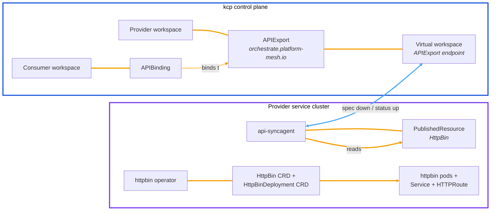
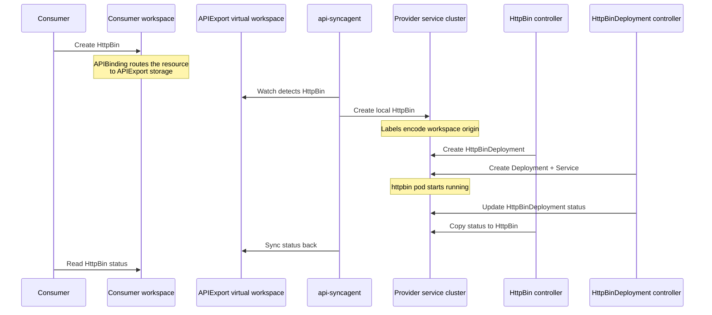

# HttpBin provider example

The HttpBin provider is the demonstration managed service provider included in the Platform Mesh local setup. This example explains how the provider side works: the CRD shape, APIExport configuration, api-syncagent bridge, and reconciliation flow.

For the consumer-side walkthrough, see [Explore the example MSP](../explore-example-msp.md). For the step-by-step provider setup, see [Provider quick start](../provider-quick-start.md).

::: info Local demo vs. production
In the local demo, all components run on one Kind cluster. In production, the provider runs the operator and api-syncagent on separate provider infrastructure. api-syncagent connects outward to the kcp API endpoint; Platform Mesh does not need inbound access to the provider cluster.
:::

## Architecture

The HttpBin provider has four main parts across the kcp control plane and the provider service cluster.

| Component | Runs on | Purpose |
| --- | --- | --- |
| APIExport | kcp provider workspace | Publishes the HttpBin API for consumers to bind. |
| api-syncagent | Provider service cluster | Bridges kcp and the service cluster and syncs resources bidirectionally. |
| httpbin operator | Provider service cluster | Reconciles HttpBin and HttpBinDeployment resources into running httpbin pods. |
| PublishedResource | Provider service cluster | Tells api-syncagent which CRD to publish to kcp. |

Consumers interact only with their kcp workspace. They do not access the provider service cluster directly.



## Consumer-facing API

The provider exposes the `HttpBin` resource from the `orchestrate.platform-mesh.io` API group. The local example keeps the API intentionally small so the provider pattern is easy to inspect.

```yaml
apiVersion: orchestrate.platform-mesh.io/v1alpha1
kind: HttpBin
metadata:
  name: my-httpbin
  namespace: default
spec:
  region: eu-west-1
status:
  ready: true
  url: https://httpbin.services.portal.localhost
  conditions:
    - type: Ready
      status: "True"
      reason: DeploymentReady
      message: HttpBin is deployed and URL is available
```

Only `HttpBin` is published to kcp. `HttpBinDeployment` is an internal implementation detail that remains on the provider service cluster.

## Provider reconciliation

The provider operator uses a two-stage reconciliation pattern:

1. The HttpBin controller watches `HttpBin`, creates a matching `HttpBinDeployment`, and copies status back to `HttpBin`.
2. The HttpBinDeployment controller creates the Deployment, Service, and optional HTTPRoute for the running httpbin workload.

api-syncagent labels synced service-cluster objects with the source workspace and object identity. The operator can use those labels to derive names and DNS entries that avoid collisions across consumer workspaces.

## PublishedResource

The provider configures api-syncagent with a `PublishedResource`. This object says which service-cluster CRD should be exposed through kcp.

```yaml
apiVersion: syncagent.kcp.io/v1alpha1
kind: PublishedResource
metadata:
  name: httpbin-local-provider
spec:
  resource:
    kind: HttpBin
    apiGroup: orchestrate.platform-mesh.io
    version: v1alpha1
```

This minimal configuration publishes the HttpBin CRD as-is. api-syncagent then:

1. Converts the CRD into an APIResourceSchema in kcp.
2. Adds the schema to the provider APIExport.
3. Watches the APIExport virtual workspace for consumer resources.
4. Syncs consumer spec down to the service cluster.
5. Syncs provider status back to the consumer workspace.

The APIExport created in kcp looks conceptually like this:

```yaml
apiVersion: apis.kcp.io/v1alpha1
kind: APIExport
metadata:
  name: orchestrate.platform-mesh.io
spec:
  resources:
    - group: orchestrate.platform-mesh.io
      name: httpbins
      schema: v250407.httpbins.orchestrate.platform-mesh.io
      storage:
        crd: {}
  permissionClaims:
    - group: ""
      resource: events
    - group: ""
      resource: namespaces
```

The schema name is versioned and immutable. If the CRD changes, api-syncagent creates a new APIResourceSchema and updates the export.

## End-to-end flow



The important direction is: spec flows from kcp to the service cluster, and status flows from the service cluster back to kcp.

## Production considerations

In production, the service cluster is owned by the provider team. The provider team runs the operator, CRDs, api-syncagent, and workloads on its own infrastructure.

api-syncagent connects outward to the kcp API endpoint. That means:

- the provider cluster needs outbound HTTPS access to kcp
- kcp does not need inbound network access to the provider cluster
- credentials are stored as a kubeconfig Secret on the provider cluster

Each api-syncagent instance handles one APIExport. A provider with multiple service APIs normally runs multiple agents, each with its own PublishedResource set and APIExport target.

## Extension points

Common ways to extend the HttpBin example include:

- adding fields to the HttpBin CRD, such as replicas or region placement
- using PublishedResource projection to rename the exposed API shape
- using PublishedResource mutation to inject provider defaults
- declaring related resources, such as Secrets or ConfigMaps, when the service needs to return credentials to consumers

For the full component behavior, see [api-syncagent](../../concepts/integration/api-syncagent.md) and the [api-syncagent component reference](../../reference/components/api-syncagent.md).

## Next

- [Provider quick start](../provider-quick-start.md)
- [Build a multi-cluster-runtime provider](../build-multi-cluster-runtime-provider.md)
- [API sharing](../../concepts/api-sharing.md)
- [Provider to consumer](../../concepts/interaction-patterns/provider-to-consumer.md)
