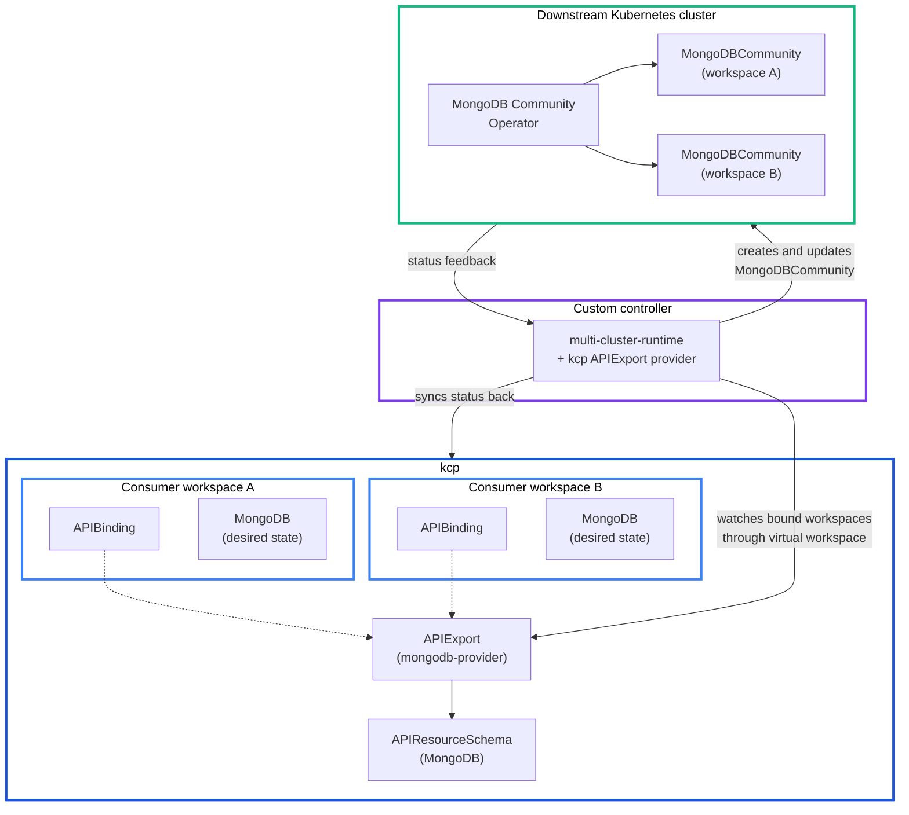

# MongoDB provider example

This example shows the advanced provider path: using multi-cluster-runtime and a custom Go controller instead of api-syncagent. The example syncs MongoDB resources between kcp consumer workspaces and a downstream Kubernetes cluster that runs the MongoDB Community Operator.

The full source code is available in [`platform-mesh/example-mongodb-multiclusterruntime`](https://github.com/platform-mesh/example-mongodb-multiclusterruntime).

::: warning Minimal example
This example is intentionally small. It does not cover object collisions, finalizer safety, related resources, multi-namespace placement, or production-grade error recovery.
:::

## When this pattern fits

Most providers should start with [api-syncagent](../../concepts/integration/api-syncagent.md). The MongoDB example uses [multi-cluster-runtime](../../concepts/integration/multi-cluster-runtime.md) because it demonstrates cases where the provider needs custom control:

- the downstream operator has lifecycle stages that need custom status mapping
- the consumer-facing API should differ from the downstream CRD
- the provider needs Go code, tests, and compile-time type safety for sync logic
- the provider needs to orchestrate more than one downstream system

The [HttpBin provider example](./httpbin-provider.md) shows the simpler api-syncagent path.

## Architecture



kcp holds the APIExport, APIResourceSchema, and consumer workspaces. The custom controller uses the kcp APIExport provider to watch all workspaces that bind to the MongoDB export. The downstream cluster runs the MongoDB Community Operator and the actual database resources.

## Define the API in kcp

With api-syncagent, the CRD on the service cluster is converted into kcp schema objects automatically. With multi-cluster-runtime, the provider defines the kcp API explicitly.

The APIResourceSchema describes the consumer-facing resource:

```yaml
apiVersion: apis.kcp.io/v1alpha1
kind: APIResourceSchema
metadata:
  name: v1.mongodbcommunity.mongodbcommunity.mongodb.com
spec:
  group: mongodbcommunity.mongodb.com
  names:
    kind: MongoDBCommunity
    listKind: MongoDBCommunityList
    plural: mongodbcommunity
    singular: mongodbcommunity
  scope: Namespaced
  versions:
    - name: v1
      served: true
      storage: true
      schema:
        openAPIV3Schema:
          type: object
          properties:
            spec:
              type: object
              properties:
                members:
                  type: integer
                type:
                  type: string
                version:
                  type: string
            status:
              type: object
              properties:
                phase:
                  type: string
                version:
                  type: string
      subresources:
        status: {}
```

The APIExport references that schema:

```yaml
apiVersion: apis.kcp.io/v1alpha1
kind: APIExport
metadata:
  name: mongodb-provider
spec:
  resources:
    - group: mongodbcommunity.mongodb.com
      name: mongodbcommunity
      schema: v1.mongodbcommunity.mongodbcommunity.mongodb.com
      storage:
        crd: {}
```

Consumers bind to this APIExport with an APIBinding and then create MongoDB resources in their own workspaces.

## Implement the controller

The controller uses controller-runtime plus multi-cluster-runtime. The kcp APIExport provider discovers all consumer workspaces that have bound to the MongoDB APIExport.

```go
import (
    "github.com/kcp-dev/multicluster-provider/apiexport"
    "k8s.io/client-go/tools/clientcmd"
    "sigs.k8s.io/controller-runtime/pkg/manager"
    mcmanager "sigs.k8s.io/multicluster-runtime/pkg/manager"
)

func main() {
    kcpConfig, err := clientcmd.BuildConfigFromFlags("", kcpKubeconfig)
    if err != nil {
        log.Fatal(err)
    }

    provider, err := apiexport.New(kcpConfig, apiexport.Options{})
    if err != nil {
        log.Fatal(err)
    }

    mgr, err := mcmanager.New(targetConfig, provider, manager.Options{})
    if err != nil {
        log.Fatal(err)
    }

    ctx := ctrl.SetupSignalHandler()
    go provider.Run(ctx, mgr)
    mgr.Start(ctx)
}
```

Register the reconciler with the multi-cluster builder:

```go
err = mcbuilder.ControllerManagedBy(mgr).
    Named("mongodb-sync").
    For(&mongodbv1.MongoDBCommunity{}).
    Complete(mcreconcile.Func(reconcileMongoDB))
```

Each reconcile request includes a cluster name that identifies the consumer workspace that produced the event.

```go
func reconcileMongoDB(
    ctx context.Context,
    req mcreconcile.Request,
) (ctrl.Result, error) {
    kcpCluster, err := mgr.GetCluster(ctx, req.ClusterName)
    if err != nil {
        return ctrl.Result{}, err
    }

    kcpClient := kcpCluster.GetClient()

    var kcpMongo mongodbv1.MongoDBCommunity
    if err := kcpClient.Get(ctx, req.NamespacedName, &kcpMongo); err != nil {
        if apierrors.IsNotFound(err) {
            return handleDeletion(ctx, req)
        }
        return ctrl.Result{}, err
    }

    downstreamMongo := &mongodbv1.MongoDBCommunity{
        ObjectMeta: metav1.ObjectMeta{
            Name:      req.Name,
            Namespace: req.Namespace,
        },
        Spec: kcpMongo.Spec,
    }

    targetClient := mgr.GetClient()
    _, err = controllerutil.CreateOrUpdate(ctx, targetClient, downstreamMongo,
        func() error {
            downstreamMongo.Spec = kcpMongo.Spec
            return nil
        })
    if err != nil {
        return ctrl.Result{}, err
    }

    kcpMongo.Status.Phase = downstreamMongo.Status.Phase
    kcpMongo.Status.Version = downstreamMongo.Status.Version
    return ctrl.Result{}, kcpClient.Status().Update(ctx, &kcpMongo)
}
```

The important choices are explicit: the controller decides how to map spec down, how to handle deletes, and which status fields to report back.

## Run the example

Apply the APIResourceSchema and APIExport to the provider workspace:

```bash
KUBECONFIG=kcp.kubeconfig kubectl apply -f sample/mongo-api.yaml
```

Build and run the controller:

```bash
git clone https://github.com/platform-mesh/example-mongodb-multiclusterruntime.git
cd example-mongodb-multiclusterruntime

go build -o mongodb-controller .

./mongodb-controller \
  --kcp-kubeconfig=/path/to/kcp.kubeconfig \
  --target-kubeconfig=/path/to/downstream.kubeconfig
```

In a consumer workspace that has an APIBinding to `mongodb-provider`, create a MongoDB resource:

```yaml
apiVersion: mongodbcommunity.mongodb.com/v1
kind: MongoDBCommunity
metadata:
  name: my-database
  namespace: default
spec:
  members: 3
  type: ReplicaSet
  version: "6.0.5"
  security:
    authentication:
      modes:
        - SCRAM
  users:
    - name: admin
      db: admin
      passwordSecretRef:
        name: admin-password
      roles:
        - name: clusterAdmin
          db: admin
        - name: userAdminAnyDatabase
          db: admin
```

The controller detects the resource, creates a matching `MongoDBCommunity` object on the downstream cluster, and syncs selected status fields back to the consumer workspace.

## Compare with HttpBin

| Aspect | HttpBin with api-syncagent | MongoDB with multi-cluster-runtime |
| --- | --- | --- |
| Integration mechanism | Generic agent | Custom Go controller |
| Sync logic | Handled by api-syncagent | Written by the provider |
| API definition | Service-cluster CRD converted through PublishedResource | Hand-authored APIResourceSchema and APIExport |
| Code required | YAML configuration | Go code |
| Status sync | Automatic status subresource sync | Provider selects status fields |
| Best for | Standard CRD-based services | Complex lifecycle or custom orchestration |

Both paths give consumers a Kubernetes API in their workspace. The provider chooses the implementation path based on how much control it needs.

## Next

- [multi-cluster-runtime](../../concepts/integration/multi-cluster-runtime.md)
- [HttpBin provider example](./httpbin-provider.md)
- [Provider quick start](../provider-quick-start.md)
- [Integration paths](../../concepts/integration-paths.md)
- [Service provider persona](../../concepts/personas/service-provider.md)
