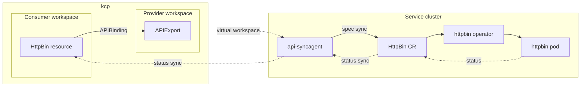
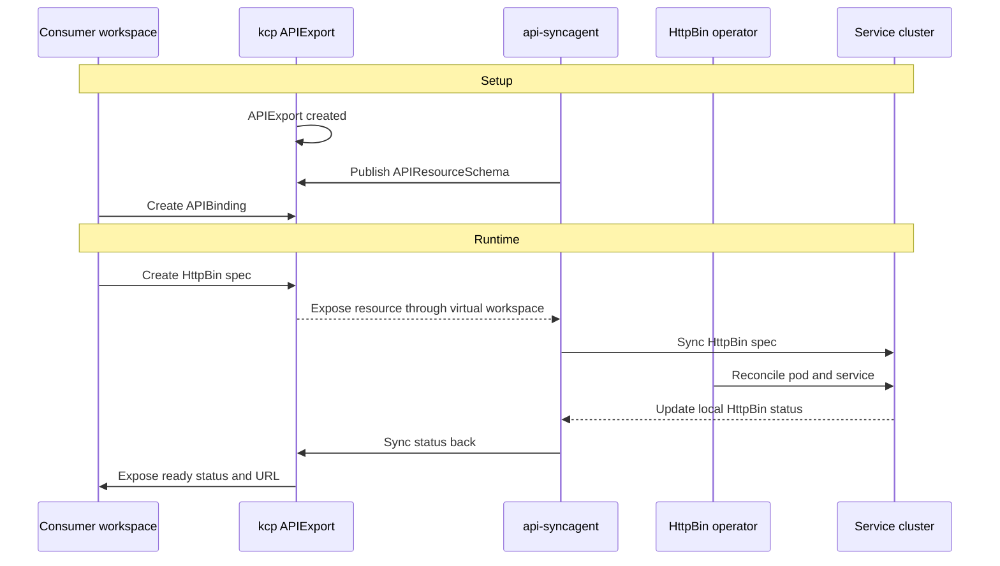

# Provider quick start

This tutorial walks you through building your first service provider in Platform Mesh with api-syncagent. You will publish the HttpBin custom resource from a Kubernetes service cluster into kcp, then verify that a consumer workspace can create an HttpBin resource and receive status back.

By the end of this tutorial, you will have:

- a provider workspace in kcp with an APIExport for the HttpBin API
- the HttpBin operator running on the service cluster
- api-syncagent synchronizing desired state and status between kcp and the service cluster
- a PublishedResource that tells api-syncagent which CRD to expose
- a consumer workspace that can bind the API and create an HttpBin resource

::: warning Development preview
The local setup is under active development. Commands and component versions may change.
:::

## Prerequisites

Before you begin, make sure you have:

- a local Platform Mesh setup without example data from [Run Platform Mesh locally](./run-platform-mesh-locally.md)
- `kubectl` with the `kubectl-kcp` plugin installed
- Helm 3 installed
- basic familiarity with Kubernetes CRDs and operators

If you already ran the example-data setup, the HttpBin provider is deployed automatically. This tutorial is most useful from a clean setup where you build the provider flow yourself.

From the `helm-charts/local-setup` directory:

```bash
task local-setup
```

## What you will build

The HttpBin provider is a simple managed service provider. Consumers create `HttpBin` resources in their kcp workspace. api-syncagent synchronizes those resources into the service cluster, where the HttpBin operator reconciles them into running pods and writes status back.


The detailed synchronization flow looks like this:



The consumer never interacts with the service cluster directly. From their perspective, HttpBin is a Kubernetes resource type available in their workspace.

## Set up kubeconfigs

In the local setup, one Kind cluster named `platform-mesh` hosts Platform Mesh and also acts as the service cluster for this tutorial. kcp runs inside that cluster, but exposes its own API server on `https://localhost:8443`.

You will use two kubeconfigs:

| Target | Kubeconfig | Purpose |
| --- | --- | --- |
| kcp | `.secret/kcp/admin.kubeconfig` | Manage workspaces, APIExports, and APIBindings. |
| Kind cluster | default Kind kubeconfig | Manage operators, pods, CRDs, and api-syncagent. |

Run this from `helm-charts/local-setup`:

```bash
export KCP_KUBECONFIG=$(pwd)/.secret/kcp/admin.kubeconfig

kind export kubeconfig --name platform-mesh
export KIND_KUBECONFIG=$HOME/.kube/config
```

Verify both connections:

```bash
KUBECONFIG=$KCP_KUBECONFIG kubectl kcp workspace use :root
kubectl --kubeconfig $KIND_KUBECONFIG get nodes
```

## Create the provider workspace

Provider workspaces are organized under `root:providers`. Create the container workspace and the HttpBin provider workspace:

```bash
KUBECONFIG=$KCP_KUBECONFIG kubectl create-workspace providers \
  --type=root:providers \
  --ignore-existing \
  --server="https://localhost:8443/clusters/root"

KUBECONFIG=$KCP_KUBECONFIG kubectl create-workspace httpbin-provider \
  --type=root:provider \
  --ignore-existing \
  --server="https://localhost:8443/clusters/root:providers"
```

Switch to the provider workspace:

```bash
KUBECONFIG=$KCP_KUBECONFIG kubectl kcp workspace use :root:providers:httpbin-provider
```

Expected output:

```text
Current workspace is "root:providers:httpbin-provider" (type root:provider).
```

## Create the APIExport

The APIExport makes the service API visible to consumers. Create it in the provider workspace:

```bash
KUBECONFIG=$KCP_KUBECONFIG kubectl apply -f - <<EOF
apiVersion: apis.kcp.io/v1alpha1
kind: APIExport
metadata:
  name: orchestrate.platform-mesh.io
spec: {}
EOF
```

Grant bind permission so a consumer workspace can create an APIBinding to this export:

```bash
KUBECONFIG=$KCP_KUBECONFIG kubectl apply -f - <<EOF
apiVersion: rbac.authorization.k8s.io/v1
kind: ClusterRole
metadata:
  name: apiexport-bind
rules:
  - apiGroups: ["apis.kcp.io"]
    resources: ["apiexports"]
    verbs: ["bind"]
---
apiVersion: rbac.authorization.k8s.io/v1
kind: ClusterRoleBinding
metadata:
  name: anonymous-view
subjects:
  - kind: User
    name: system:anonymous
    apiGroup: rbac.authorization.k8s.io
roleRef:
  kind: ClusterRole
  name: apiexport-bind
  apiGroup: rbac.authorization.k8s.io
EOF
```

Verify the APIExport:

```bash
KUBECONFIG=$KCP_KUBECONFIG kubectl get apiexports
```

Expected output:

```text
NAME                           AGE
orchestrate.platform-mesh.io   5s
```

## Deploy the HttpBin operator

The HttpBin operator runs on the service cluster. api-syncagent handles the integration with kcp, so the operator itself does not need to know about Platform Mesh.

Run this from the `helm-charts` repository root:

```bash
cd ..

helm install example-httpbin-operator \
  ./charts/example-httpbin-operator \
  --kubeconfig $KIND_KUBECONFIG \
  -n example-httpbin-provider \
  --create-namespace
```

Verify the operator:

```bash
kubectl --kubeconfig $KIND_KUBECONFIG \
  get pods -n example-httpbin-provider
```

Verify the CRD:

```bash
kubectl --kubeconfig $KIND_KUBECONFIG \
  get crd httpbins.orchestrate.platform-mesh.io
```

The CRD defines an `HttpBin` resource with a `spec.region` field and a status subresource:

```yaml
apiVersion: orchestrate.platform-mesh.io/v1alpha1
kind: HttpBin
metadata:
  name: my-httpbin
spec:
  region: eu-west-1
status:
  ready: false
  url: ""
  conditions: []
```

The status subresource matters because api-syncagent uses it to synchronize provider status back to kcp.

## Deploy api-syncagent

api-syncagent runs on the service cluster and connects to kcp. It needs a kubeconfig Secret for kcp access.

Create the Secret:

```bash
kubectl --kubeconfig $KIND_KUBECONFIG \
  create secret generic httpbin-kubeconfig \
  -n example-httpbin-provider \
  --from-file=kubeconfig=$KCP_KUBECONFIG
```

In the local setup, kcp is exposed through Traefik on `localhost:8443`. Pods need a host alias so in-cluster traffic can resolve that address correctly.

```bash
TRAEFIK_IP=$(kubectl --kubeconfig $KIND_KUBECONFIG \
  get svc traefik -n default -o jsonpath='{.spec.clusterIP}')
echo "Traefik ClusterIP: $TRAEFIK_IP"
```

Install api-syncagent:

```bash
helm repo add kcp https://kcp-dev.github.io/helm-charts
helm repo update

helm install api-syncagent kcp/api-syncagent \
  --kubeconfig $KIND_KUBECONFIG \
  -n example-httpbin-provider \
  --set apiExportEndpointSliceName=orchestrate.platform-mesh.io \
  --set agentName=kcp-api-syncagent \
  --set kcpKubeconfig=httpbin-kubeconfig \
  --set hostAliases.enabled=true \
  --set "hostAliases.values[0].ip=$TRAEFIK_IP" \
  --set "hostAliases.values[0].hostnames[0]=localhost"
```

Grant RBAC for api-syncagent on the service cluster:

```bash
kubectl --kubeconfig $KIND_KUBECONFIG apply -f - <<EOF
apiVersion: rbac.authorization.k8s.io/v1
kind: ClusterRole
metadata:
  name: api-syncagent-httpbin
rules:
  - apiGroups: ["orchestrate.platform-mesh.io"]
    resources: ["httpbins", "httpbins/status"]
    verbs: ["*"]
  - apiGroups: [""]
    resources: ["namespaces"]
    verbs: ["*"]
---
apiVersion: rbac.authorization.k8s.io/v1
kind: ClusterRoleBinding
metadata:
  name: api-syncagent-httpbin
subjects:
  - kind: ServiceAccount
    name: api-syncagent
    namespace: example-httpbin-provider
roleRef:
  kind: ClusterRole
  name: api-syncagent-httpbin
  apiGroup: rbac.authorization.k8s.io
EOF
```

Verify api-syncagent:

```bash
kubectl --kubeconfig $KIND_KUBECONFIG \
  get pods -n example-httpbin-provider -l app.kubernetes.io/name=kcp-api-syncagent
```

## Create a PublishedResource

PublishedResource tells api-syncagent which CRD to publish into kcp. Create it on the service cluster:

```bash
kubectl --kubeconfig $KIND_KUBECONFIG apply -f - <<EOF
apiVersion: syncagent.kcp.io/v1alpha1
kind: PublishedResource
metadata:
  name: httpbin-local-provider
spec:
  resource:
    kind: HttpBin
    apiGroup: orchestrate.platform-mesh.io
    version: v1alpha1
EOF
```

api-syncagent will create an APIResourceSchema in kcp and update the APIExport.

Verify the schema:

```bash
KUBECONFIG=$KCP_KUBECONFIG kubectl kcp workspace use :root:providers:httpbin-provider
KUBECONFIG=$KCP_KUBECONFIG kubectl get apiresourceschemas
```

Verify the APIExport references the schema:

```bash
KUBECONFIG=$KCP_KUBECONFIG kubectl get apiexport orchestrate.platform-mesh.io -o yaml
```

Look for `spec.resources`.

Check the agent logs:

```bash
kubectl --kubeconfig $KIND_KUBECONFIG \
  logs -n example-httpbin-provider -l app.kubernetes.io/name=kcp-api-syncagent --tail=20
```

## Test the consumer flow

Create a consumer workspace:

```bash
KUBECONFIG=$KCP_KUBECONFIG kubectl create-workspace test-consumer \
  --server="https://localhost:8443/clusters/root"

KUBECONFIG=$KCP_KUBECONFIG kubectl kcp workspace use :root:test-consumer
```

Create an APIBinding:

```bash
KUBECONFIG=$KCP_KUBECONFIG kubectl apply -f - <<EOF
apiVersion: apis.kcp.io/v1alpha1
kind: APIBinding
metadata:
  name: orchestrate.platform-mesh.io
spec:
  reference:
    export:
      name: orchestrate.platform-mesh.io
      path: "root:providers:httpbin-provider"
  permissionClaims:
  - resource: namespaces
    state: Accepted
    all: true
  - resource: events
    state: Accepted
    all: true
EOF
```

Verify the binding:

```bash
KUBECONFIG=$KCP_KUBECONFIG kubectl get apibindings
```

Verify the API is available:

```bash
KUBECONFIG=$KCP_KUBECONFIG kubectl api-resources | grep httpbin
```

Create an HttpBin instance:

```bash
KUBECONFIG=$KCP_KUBECONFIG kubectl apply -f - <<EOF
apiVersion: orchestrate.platform-mesh.io/v1alpha1
kind: HttpBin
metadata:
  name: my-httpbin
  namespace: default
spec:
  region: eu-west-1
EOF
```

Check the service cluster for the synchronized resource:

```bash
kubectl --kubeconfig $KIND_KUBECONFIG get httpbins --all-namespaces
kubectl --kubeconfig $KIND_KUBECONFIG get pods --all-namespaces | grep httpbin
```

Check status back in kcp:

```bash
KUBECONFIG=$KCP_KUBECONFIG kubectl kcp workspace use :root:test-consumer
KUBECONFIG=$KCP_KUBECONFIG kubectl get httpbin my-httpbin -n default -o yaml
```

Look for a populated `status` section with readiness and URL information. If status is still empty, wait a few seconds and check the operator and api-syncagent logs.

## Review the data flow



The HttpBin operator did not need Platform Mesh-specific code. api-syncagent handled the integration path by publishing the CRD to kcp and synchronizing resources between the consumer workspace and the service cluster.

## Next

Continue with [api-syncagent](/concepts/integration/api-syncagent.md) for the architecture behind what you just built.

Optional branches:

- [Service provider persona](/concepts/personas/service-provider.md) for the role context.
- [Provider to consumer](/concepts/interaction-patterns/provider-to-consumer.md) for the broader interaction pattern.
- [api-syncagent component reference](/reference/components/api-syncagent.md) for configuration options.
