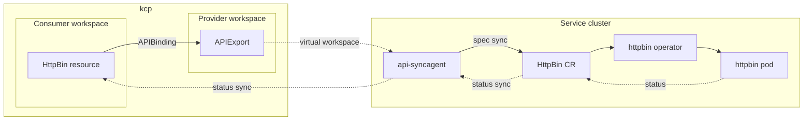
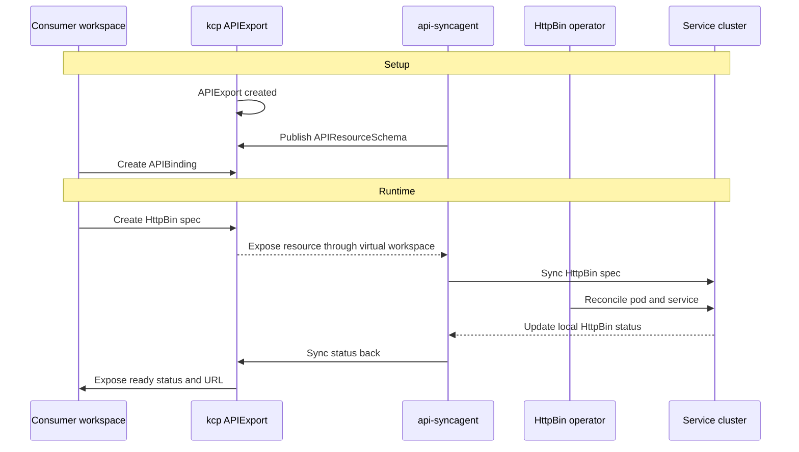

# Provider quick start

This tutorial walks you through building your first service provider in Platform Mesh with api-syncagent. You will publish the HttpBin custom resource from a Kubernetes service cluster into kcp, then verify that a consumer workspace can create an HttpBin resource and receive status back.

::: tip No code provider
This provider is considered "no code", as all components are built and deployed. 
It is using generic UI of Platform-Mesh and api-syncagent, without any custom provider-specific code. You will deploy the HttpBin operator as a black box and use api-syncagent to publish its CRD into kcp and synchronize resources.
:::

By the end of this tutorial, you will have:

- a provider workspace in kcp with an APIExport for the HttpBin API
- the HttpBin operator running on the service cluster
- api-syncagent synchronizing desired state and status between kcp and the service cluster
- a PublishedResource that tells api-syncagent which CRD to expose
- a consumer workspace that can bind the API and create an HttpBin resource


::: warning Development preview
The local setup is under active development. Commands and component versions may change.
:::

## Prerequisites

Before you begin, make sure you have:

- a local Platform Mesh setup without example data from [Set up Platform Mesh locally](/how-to-guides/set-up-platform-mesh-locally.md)
- `kubectl` with the `kubectl-kcp` plugin installed
- Helm 3 installed
- basic familiarity with Kubernetes CRDs and operators

If you already ran the example-data setup, the HttpBin provider is deployed automatically. This tutorial is most useful from a clean setup where you build the provider flow yourself.

From the `helm-charts/local-setup` directory:

```bash
task local-setup
```

## What you will build

The HttpBin provider is a simple managed service provider. Consumers create `HttpBin` resources in their kcp workspace. api-syncagent synchronizes those resources into the service cluster, where the HttpBin operator reconciles them into running pods and writes status back.


The detailed synchronization flow looks like this:



The consumer never interacts with the service cluster directly. From their perspective, HttpBin is a Kubernetes resource type available in their workspace.

## Set up kubeconfigs

In the local setup, one Kind cluster named `platform-mesh` hosts Platform Mesh and also acts as the service cluster for this tutorial. kcp runs inside that cluster, but exposes its own API server on `https://localhost:8443`.

You will use two kubeconfigs:

| Target | Kubeconfig | Purpose |
| --- | --- | --- |
| kcp | `.secret/kcp/admin.kubeconfig` | Manage workspaces, APIExports, and APIBindings. |
| Kind cluster | default Kind kubeconfig | Manage operators, pods, CRDs, and api-syncagent. |

Run this from `helm-charts/local-setup`:

```bash
export PM_KUBECONFIG=$(pwd)/.secret/kcp/admin.kubeconfig

kind export kubeconfig --name platform-mesh
export COMPUTE_KUBECONFIG=$HOME/.kube/config
```

Verify both connections:

```bash
KUBECONFIG=$PM_KUBECONFIG kubectl kcp workspace use :root
kubectl --kubeconfig $COMPUTE_KUBECONFIG get nodes
```

## Create the provider workspace

Provider workspaces are organized under `root:providers`. Create the container workspace and the HttpBin provider workspace:

::: tip Using the Provider resource
This tutorial creates the workspace directly using kcp admin credentials. Service providers who follow the normal onboarding path would instead create a `Provider` resource and let the controller provision the workspace and kubeconfig — see [Bootstrap a provider](/how-to-guides/bootstrap-provider.md).
:::

```bash
KUBECONFIG=$PM_KUBECONFIG kubectl ws use :
KUBECONFIG=$PM_KUBECONFIG kubectl create-workspace providers --type=root:providers --enter --ignore-existing
KUBECONFIG=$PM_KUBECONFIG kubectl create-workspace httpbin-provider --type=root:provider --enter --ignore-existing
```

Expected output:

```text
Current workspace is "root:providers:httpbin-provider" (type root:provider).
```

## Create the APIExport

The APIExport makes the service API visible to consumers. Create it in the provider workspace:

```bash
KUBECONFIG=$PM_KUBECONFIG kubectl apply -f - <<EOF
apiVersion: apis.kcp.io/v1alpha1
kind: APIExport
metadata:
  name: orchestrate.platform-mesh.io
  labels:
    ui.platform-mesh.io/content-for: orchestrate.platform-mesh.io
spec: {}
EOF
```

Grant bind permission so a consumer workspace can create an APIBinding to this export:

```bash
KUBECONFIG=$PM_KUBECONFIG kubectl apply -f - <<EOF
apiVersion: rbac.authorization.k8s.io/v1
kind: ClusterRole
metadata:
  name: apiexport-bind
rules:
  - apiGroups: ["apis.kcp.io"]
    resources: ["apiexports"]
    verbs: ["bind"]
---
apiVersion: rbac.authorization.k8s.io/v1
kind: ClusterRoleBinding
metadata:
  name: anonymous-view
subjects:
  - kind: User
    name: system:anonymous
    apiGroup: rbac.authorization.k8s.io
roleRef:
  kind: ClusterRole
  name: apiexport-bind
  apiGroup: rbac.authorization.k8s.io
EOF
```

Verify the APIExport:

```bash
KUBECONFIG=$PM_KUBECONFIG kubectl get apiexports
```

Expected output:

```text
NAME                           AGE
orchestrate.platform-mesh.io   5s
```

## Deploy the HttpBin operator

The HttpBin operator runs on the service cluster. api-syncagent handles the integration with kcp, so the operator itself does not need to know about Platform Mesh.

Create the following `values.yaml` file:

```yaml
operator:
  args:
    - --local-http-route
    - --local-http-route-port=8443
    - --local-http-route-gateway-name=k8sapi-gateway
    - --local-http-route-gateway-namespace=platform-mesh-system
    - --domain=httpbin.services.portal.localhost
```

Run this from the `helm-charts` repository root:

```bash
cd ..

helm upgrade --install example-httpbin-operator \
  ./charts/example-httpbin-operator \
  --kubeconfig $COMPUTE_KUBECONFIG \
  -n example-httpbin-provider \
  --create-namespace \
  -f ./values.yaml
```

Verify the operator:

```bash
KUBECONFIG=$COMPUTE_KUBECONFIG kubectl get pods -n example-httpbin-provider
```

Verify the CRD:

```bash
KUBECONFIG=$COMPUTE_KUBECONFIG kubectl get crd httpbins.orchestrate.platform-mesh.io
```

The CRD defines an `HttpBin` resource with a `spec.region` field and a status subresource:

```yaml
apiVersion: orchestrate.platform-mesh.io/v1alpha1
kind: HttpBin
metadata:
  name: my-httpbin
spec:
  region: eu-west-1
status:
  ready: false
  url: ""
  conditions: []
```

The status subresource matters because api-syncagent uses it to synchronize provider status back to kcp.

## Deploy api-syncagent

api-syncagent runs on the service cluster and connects to kcp. It needs a kubeconfig Secret for kcp access.

Create the Secret:

```bash
KUBECONFIG=$COMPUTE_KUBECONFIG kubectl create secret generic httpbin-kubeconfig \
  -n example-httpbin-provider \
  --from-file=kubeconfig=$PM_KUBECONFIG
```

In the local setup, kcp is exposed through Traefik on `localhost:8443` at the pinned ClusterIP `10.96.188.4`. Pods need host aliases so in-cluster traffic can resolve the kcp hostnames to that address. These values match the `hostAliases` block in the canonical `example-httpbin-provider` HelmRelease in the local-setup.

Install api-syncagent:

```bash
helm repo add kcp https://kcp-dev.github.io/helm-charts
helm repo update

helm upgrade --install api-syncagent kcp/api-syncagent \
  --kubeconfig $COMPUTE_KUBECONFIG \
  -n example-httpbin-provider \
  --set apiExportEndpointSliceName=orchestrate.platform-mesh.io \
  --set agentName=kcp-api-syncagent \
  --set kcpKubeconfig=httpbin-kubeconfig \
  --set hostAliases.enabled=true \
  --set "hostAliases.values[0].ip=10.96.188.4" \
  --set "hostAliases.values[0].hostnames[0]=localhost" \
  --set "hostAliases.values[0].hostnames[1]=portal.localhost" \
  --set "hostAliases.values[0].hostnames[2]=kcp.localhost" \
  --set "hostAliases.values[0].hostnames[3]=root.kcp.localhost"
```

Grant RBAC for api-syncagent on the service cluster:

```bash
KUBECONFIG=$COMPUTE_KUBECONFIG kubectl apply -f - <<EOF
apiVersion: rbac.authorization.k8s.io/v1
kind: ClusterRole
metadata:
  name: api-syncagent-httpbin
rules:
  - apiGroups: ["orchestrate.platform-mesh.io"]
    resources: ["httpbins", "httpbins/status"]
    verbs: ["*"]
  - apiGroups: [""]
    resources: ["namespaces"]
    verbs: ["*"]
---
apiVersion: rbac.authorization.k8s.io/v1
kind: ClusterRoleBinding
metadata:
  name: api-syncagent-httpbin
subjects:
  - kind: ServiceAccount
    name: api-syncagent
    namespace: example-httpbin-provider
roleRef:
  kind: ClusterRole
  name: api-syncagent-httpbin
  apiGroup: rbac.authorization.k8s.io
EOF
```

Verify api-syncagent:

```bash
KUBECONFIG=$COMPUTE_KUBECONFIG kubectl get pods -n example-httpbin-provider -l app.kubernetes.io/name=kcp-api-syncagent
```

## Create a PublishedResource

PublishedResource tells api-syncagent which CRD to publish into kcp. Create it on the service cluster:

```bash
KUBECONFIG=$COMPUTE_KUBECONFIG kubectl apply -f - <<EOF
apiVersion: syncagent.kcp.io/v1alpha1
kind: PublishedResource
metadata:
  name: httpbin-local-provider
spec:
  resource:
    kind: HttpBin
    apiGroup: orchestrate.platform-mesh.io
    version: v1alpha1
EOF
```

api-syncagent will create an APIResourceSchema in kcp and update the APIExport.

Verify the schema:

```bash
KUBECONFIG=$PM_KUBECONFIG kubectl kcp workspace use :root:providers:httpbin-provider
KUBECONFIG=$PM_KUBECONFIG kubectl get apiresourceschemas
```

Verify the APIExport references the schema:

```bash
KUBECONFIG=$PM_KUBECONFIG kubectl get apiexport orchestrate.platform-mesh.io -o yaml
```

Look for the published schemas in the `spec` block.

Check the agent logs:

```bash
KUBECONFIG=$COMPUTE_KUBECONFIG kubectl logs -n example-httpbin-provider -l app.kubernetes.io/name=kcp-api-syncagent --tail=20
```

## Test the consumer flow

Login into https://portal.localhost:8443 and create organization `test-consumer`:


Create an account under the organization. 


Wait until the account is ready, then download the kubeconfig and set the environment variable:


```bash
export CONSUMER_KUBECONFIG=/path/to/consumer-kubeconfig
```

Create an APIBinding:

```bash
KUBECONFIG=$CONSUMER_KUBECONFIG kubectl apply -f - <<EOF
apiVersion: apis.kcp.io/v1alpha1
kind: APIBinding
metadata:
  name: orchestrate.platform-mesh.io
spec:
  reference:
    export:
      name: orchestrate.platform-mesh.io
      path: "root:providers:httpbin-provider"
  permissionClaims:
  - resource: namespaces
    state: Accepted
    all: true
  - resource: events
    state: Accepted
    all: true
EOF
```

Verify the binding:

```bash
KUBECONFIG=$CONSUMER_KUBECONFIG kubectl get apibindings
```

Verify the API is available:

```bash
KUBECONFIG=$CONSUMER_KUBECONFIG kubectl api-resources | grep httpbin
```

Create an HttpBin instance:

```bash
KUBECONFIG=$CONSUMER_KUBECONFIG kubectl apply -f - <<EOF
apiVersion: orchestrate.platform-mesh.io/v1alpha1
kind: HttpBin
metadata:
  name: my-httpbin
  namespace: default
spec:
  region: eu-west-1
EOF
```

Check the service cluster for the synchronized resource:

```bash
KUBECONFIG=$COMPUTE_KUBECONFIG kubectl get httpbins --all-namespaces
KUBECONFIG=$COMPUTE_KUBECONFIG kubectl get pods --all-namespaces | grep httpbin
```

Check status back in kcp:

```bash
KUBECONFIG=$CONSUMER_KUBECONFIG kubectl get httpbin my-httpbin -n default -o yaml
```

Look for a populated `status` section with readiness and URL information. If status is still empty, wait a few seconds and check the operator and api-syncagent logs.

## Review the data flow



The HttpBin operator did not need Platform Mesh-specific code. api-syncagent handled the integration path by publishing the CRD to kcp and synchronizing resources between the consumer workspace and the service cluster.

## Marketplace

So far the HttpBin API works end-to-end on the command line, but the Platform Mesh portal still has no idea it exists. To make the provider discoverable in the [Marketplace](/reference/components/marketplace.md) and to add a navigation entry for the resource in the UI, you create two resources in the provider workspace:

| Resource | Purpose |
| --- | --- |
| `ProviderMetadata` | Registers your provider with the Marketplace — display name, description, contacts, icons. |
| `ContentConfiguration` | Adds Luigi navigation nodes and views to the portal for your APIExport. |

Both resources live in the provider workspace alongside the `APIExport`:

```bash
KUBECONFIG=$PM_KUBECONFIG kubectl kcp workspace use :root:providers:httpbin-provider
```

### Register the provider

Apply a `ProviderMetadata` whose name matches the `APIExport` name. The Marketplace virtual workspace joins these two on name to build a `MarketplaceEntry`.

```bash
KUBECONFIG=$PM_KUBECONFIG kubectl apply -f - <<EOF
apiVersion: ui.platform-mesh.io/v1alpha1
kind: ProviderMetadata
metadata:
  name: orchestrate.platform-mesh.io
spec:
  displayName: HttpBin Provider
  description: |
    Example provider for the Platform Mesh quickstart.
    Provisions HttpBin instances on a service cluster.
  contacts:
    - displayName: HttpBin Team
      email: httpbin@platform-mesh.io
      role: ["Maintainer"]
  preferredSupportChannels:
    - displayName: HttpBin Support
      url: https://github.com/platform-mesh/platform-mesh.github.io
  icon:
    light:
      data: "data:image/svg+xml;base64,PHN2ZyB4bWxucz0iaHR0cDovL3d3dy53My5vcmcvMjAwMC9zdmciIHZpZXdCb3g9IjAgMCAyMDAgMjAwIj4KICA8Y2lyY2xlIGN4PSIxMDAiIGN5PSIxMDAiIHI9IjkwIiBmaWxsPSIjMmM3YmU1IiAvPgogIDx0ZXh0IHg9IjEwMCIgeT0iMTE1IiBmb250LWZhbWlseT0iQXJpYWwsIHNhbnMtc2VyaWYiIGZvbnQtc2l6ZT0iNDAiIGZvbnQtd2VpZ2h0PSJib2xkIiB0ZXh0LWFuY2hvcj0ibWlkZGxlIiBmaWxsPSIjZmZmIj5IVFRQPC90ZXh0Pgo8L3N2Zz4K"
    dark:
      data: "data:image/svg+xml;base64,PHN2ZyB4bWxucz0iaHR0cDovL3d3dy53My5vcmcvMjAwMC9zdmciIHZpZXdCb3g9IjAgMCAyMDAgMjAwIj4KICA8Y2lyY2xlIGN4PSIxMDAiIGN5PSIxMDAiIHI9IjkwIiBmaWxsPSIjMmM3YmU1IiAvPgogIDx0ZXh0IHg9IjEwMCIgeT0iMTE1IiBmb250LWZhbWlseT0iQXJpYWwsIHNhbnMtc2VyaWYiIGZvbnQtc2l6ZT0iNDAiIGZvbnQtd2VpZ2h0PSJib2xkIiB0ZXh0LWFuY2hvcj0ibWlkZGxlIiBmaWxsPSIjZmZmIj5IVFRQPC90ZXh0Pgo8L3N2Zz4K"
EOF
```

::: tip Matching names
The `metadata.name` of the `ProviderMetadata` **must** match the `APIExport` name (`orchestrate.platform-mesh.io`). The Marketplace builds entries by joining the two.
:::

### Add a UI navigation entry

`ContentConfiguration` carries a Luigi config fragment that the portal merges into its navigation tree. The `ui.platform-mesh.io/content-for` label links the configuration to your APIExport — without it, the portal will not load this fragment when the consumer binds the API.

```bash
KUBECONFIG=$PM_KUBECONFIG kubectl apply -f - <<EOF
apiVersion: ui.platform-mesh.io/v1alpha1
kind: ContentConfiguration
metadata:
  labels:
    ui.platform-mesh.io/entity: core_platform-mesh_io_account
    ui.platform-mesh.io/content-for: orchestrate.platform-mesh.io
  name: httpbin-ui
spec:
  inlineConfiguration:
    content: |-
      {
          "name": "httpbins",
          "creationTimestamp": "2022-05-17T11:37:17Z",
          "luigiConfigFragment": {
              "data": {
                  "nodes": [
                      {
                          "pathSegment": "orchestrate_platform-mesh_io_httpbins",
                          "navigationContext": "orchestrate_platform-mesh_io_httpbins",
                          "label": "Http Bins",
                          "icon": "paint-bucket",
                          "order": 800,
                          "entityType": "main.core_platform-mesh_io_account",
                          "loadingIndicator": {
                              "enabled": false
                          },
                          "keepSelectedForChildren": true,
                          "url": "/assets/platform-mesh-portal-ui-wc.js#generic-list-view",
                          "webcomponent": {
                              "selfRegistered": true
                          },
                          "context": {
                              "resourceDefinition": {
                                  "apiGroup": "orchestrate_platform_mesh_io",
                                  "entityCollection": "HttpBins",
                                  "version": "v1alpha1",
                                  "entity": "HttpBin",
                                  "scope": "Namespaced",
                                  "namespace": null,
                                  "readyCondition": {
                                    "jsonPathExpression": "status.ready",
                                    "property": ["status.ready"]
                                  },
                                  "ui": {
                                      "logoUrl": "https://www.kcp.io/icons/logo.svg",
                                      "listView": {
                                          "fields": [
                                              {
                                                  "label": "Name",
                                                  "property": "metadata.name"
                                              },
                                              {
                                                  "label": "Ready",
                                                  "property": "status.ready",
                                                  "uiSettings": {
                                                    "displayAs": "boolIcon"
                                                  }
                                              },
                                              {
                                                  "label": "Link",
                                                  "property": "status.url",
                                                  "uiSettings": {
                                                    "displayAs": "link"
                                                  }
                                              }
                                          ]
                                      },
                                      "detailView": {
                                        "fields": [
                                          {
                                            "label": "Name",
                                            "property": "metadata.name"
                                          }
                                        ]
                                      },
                                      "createView": {
                                          "fields": [
                                              {
                                                  "label": "Name",
                                                  "property": "metadata.name",
                                                  "required": true
                                              }
                                          ]
                                      }
                                  }
                              }
                          },
                          "children": [
                            {
                                "pathSegment": ":httpbinId",
                                "hideFromNav": true,
                                "keepSelectedForChildren": false,
                                "defineEntity": {
                                    "id": "orchestrate_platform-mesh_io_httpbin",
                                    "contextKey": "httpbinId",
                                    "graphqlEntity": {
                                        "group": "orchestrate_platform-mesh_io",
                                        "version": "v1alpha1",
                                        "kind": "HttpBin",
                                        "query": "{ metadata { name } }"
                                    }
                                },
                                "context": {
                                    "accountId": ":accountId",
                                    "httpbinId": ":httpbinId",
                                    "resourceId": ":httpbinId"
                                }
                            }
                          ]
                      },
                      {
                        "entityType": "main.core_platform-mesh_io_account.orchestrate_platform-mesh_io_httpbin",
                        "pathSegment": "dashboard",
                        "label": "Dashboard",
                        "url": "/assets/platform-mesh-portal-ui-wc.js#generic-detail-view",
                        "webcomponent": {
                          "selfRegistered": true
                        },
                        "defineEntity": {
                            "id": "dashboard"
                        },
                        "compound": {
                            "children": []
                        }
                      }
                  ]
              }
          }
      }
    contentType: json
EOF
```

### See it in the portal

Open the portal at `https://portal.localhost:8443` as the consumer account you created earlier. Under **Marketplace**, the HttpBin Provider tile should now appear. Clicking **Install** creates an `APIBinding` in the consumer workspace — equivalent to the manifest you applied by hand in the [Test the consumer flow](#test-the-consumer-flow) step. After installation, a **HttpBins** entry appears in the left navigation, listing the resources you created.

## Next

Continue with [Consume a service from a controller](./consume-service-from-controller.md) to build the consumer side of the loop you just opened.

Optional branches:

- [api-syncagent](/concepts/integration/api-syncagent.md) for the architecture behind what you just built.
- [Build a multicluster-runtime provider](./build-multicluster-runtime-provider.md) for the advanced provider track.
- [Service provider persona](/concepts/personas/service-provider.md) for the role context.
